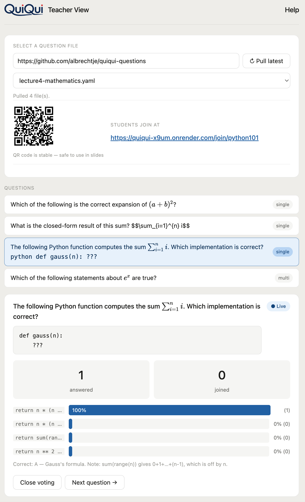
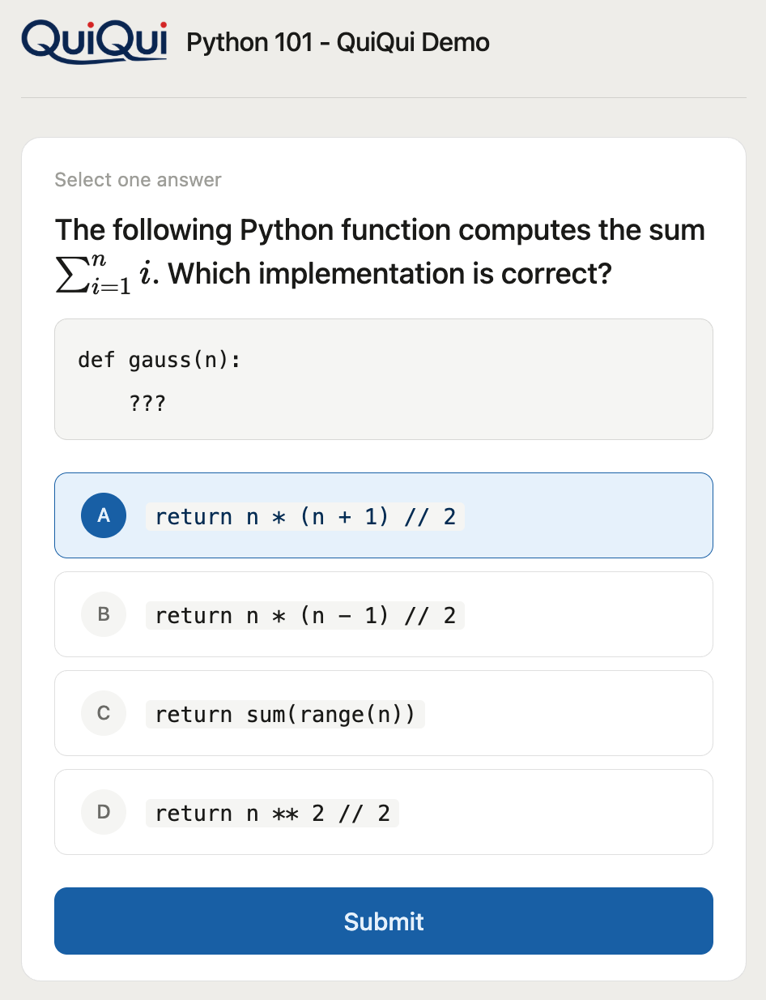
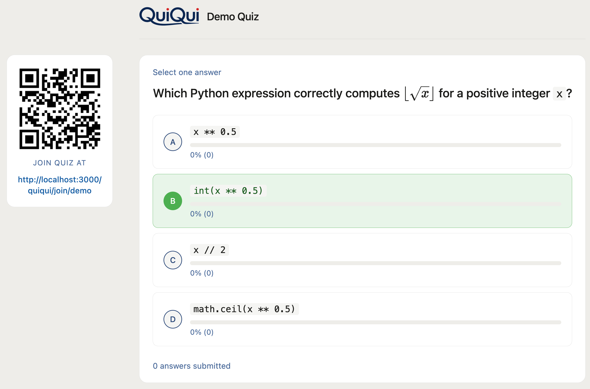

# Quickstart for Lecturers

> Part of the [QuiQui](https://github.com/th-nuernberg/quiqui) open source project. Hosted instance: [quiqui-x9um.onrender.com](https://quiqui-x9um.onrender.com) (may take ~30s to wake up on first visit).

QuiQui lets you pose a question to your class and see live answers on screen — no app, no login, no setup for students.

---

## What you need

- Your QuiQui teacher URL (bookmarked once, reused every lecture)
- A public GitHub repository with your question files — see [th-nuernberg/quiqui-questions](https://github.com/th-nuernberg/quiqui-questions) for the format

---

## Before the lecture (once)

1. **Set up your question repo** on GitHub with a [`config.yaml`](https://github.com/th-nuernberg/quiqui-questions/blob/main/config.yaml) and one `.yaml` file per lecture topic — see [Setting up `config.yaml`](#setting-up-configyaml) below
2. **Bookmark your teacher URL:**
   ```
   https://quiqui-x9um.onrender.com/<teacher-slug>?repo=https://github.com/you/quiqui-questions
   ```
   You have two options here:
   - **Use a hosted instance** (e.g. [quiqui-x9um.onrender.com](https://quiqui-x9um.onrender.com)) — contact the [hosted service operator](https://quiqui-x9um.onrender.com/impressum#en) to receive your teacher slug, which goes in place of `<teacher-slug>` above.
   - **Deploy your own instance** — QuiQui is open source ([th-nuernberg/quiqui](https://github.com/th-nuernberg/quiqui)); deploy it yourself (e.g. on Render) and set your own `TEACHER_SLUG`. You then control your own teacher URL.
3. **Put the student QR code or URL in your slides** — it never changes as long as `session_url` in `config.yaml` stays the same. The `session_url` must be **globally unique** on the server — see [Choosing a unique `session_url`](#choosing-a-unique-session_url) below
4. **Optionally bookmark the projector URL** (`/view/<session_url>`) to open in your browser during the lecture — it shows the live question and results on your beamer alongside the QR code

---

## Setting up `config.yaml`

Every question repo needs a `config.yaml` in its root. Start from the template: **[config.yaml in the question repo](https://github.com/th-nuernberg/quiqui-questions/blob/main/config.yaml)** — copy it into your own repo and edit the values.

```yaml
session_url: thn-db-alb      # unique student join URL segment — see below
title: Databases             # shown as "QuiQui: Databases" in header and tab
student_shortlink: https://t.ly/abc   # optional, a short link students can type
```

Step by step:

1. **Create your repo** — fork [th-nuernberg/quiqui-questions](https://github.com/th-nuernberg/quiqui-questions) or start a fresh public GitHub repo
2. **Add `config.yaml`** to the repo root, using the template above as a starting point
3. **Set `session_url`** to a unique value (see the next section — this is the important one)
4. **Set `title`** to your lecture name — it appears as `QuiQui: <title>` on the teacher and student pages
5. **Optionally set `student_shortlink`** if you have a short URL (e.g. from t.ly or your own redirect) that's easier for students to type than the full `/join/...` link
6. **Commit and push** — your repo is now ready to use

### Choosing a unique `session_url`

> ⚠️ **`session_url` must be globally unique on the server.** A session is identified by its `session_url`, not by you — anyone running with the same value (including colleagues sharing one question repo) shares **one** live session, silently overwriting each other's active question and mixing students' votes together. Don't use a generic lecture name like `databases`; prefix it to make it unmistakably yours, e.g. `thn-db-alb`. Full naming guide: [Choosing a `session_url`](https://github.com/th-nuernberg/quiqui-questions#choosing-a-session_url) in the question repo README.

---

## Designing your questions

Questions live in `.yaml` files in your repo — one file per lecture topic. The **[question repo README](https://github.com/th-nuernberg/quiqui-questions)** is the full reference: field format, Markdown + LaTeX support, copy-paste examples, ready-made templates, and even a prompt for generating a question file with ChatGPT or Claude. Start there.

Two things to decide before you write questions:

- **Scored or generic?** Include a `correct` field and the **✓ Reveal** button highlights the right option(s) in green for the room. Omit it to keep the question text in your slides and just collect votes — Reveal is hidden, and answers show as letter badges (A, B, C, …). The ready-made [`generic.yaml`](https://github.com/th-nuernberg/quiqui-questions/blob/main/generic.yaml) has A/B/C/D, Yes/No, True/False, and agreement-scale templates for this mode.
- **Which file to start from?** The per-lecture examples like [`lecture1-python-basics.yaml`](https://github.com/th-nuernberg/quiqui-questions/blob/main/lecture1-python-basics.yaml) show scored single- and multiple-choice questions with explanations.

To change questions later, edit the `.yaml` files in GitHub and click **Pull latest** in the teacher view — no server restart needed.

---

## During the lecture



1. **Open your bookmarked teacher URL** — the repo is pulled automatically and the QR code appears
2. **Project the QR code** so students can join (or share the URL verbally)
3. **Select a lecture file** from the dropdown, then click a question to preview it
4. **Click ▶ Activate** — voting opens; badge shows **● Active**. Click again (**⏹ Deactivate**) to stop voting without revealing answers — students see the result bars but no highlights
5. **Click ✓ Reveal** to show the correct answers highlighted in green for everyone in the room
6. **Click ✕ Close** to send students back to the waiting screen without revealing answers
7. **Click Next question →** to move on — students return to the waiting screen automatically

> **Happy path:** Activate → (students vote) → Reveal → Close → Next question →

> **Tip:** Open the teacher page a minute before class — the app may take ~30 seconds to wake up on the free Render plan.

> **Session lifetime:** A session expires after **90 minutes of inactivity**. After expiry, click **Pull latest** to start a fresh session — the student URL stays the same.

---

## What students see



Students visit the join URL or scan the QR code — no login, no app install. They see "Waiting for the next question" until you activate a question. After submitting their answer (only once per question), the result bars appear live under each answer option.

- **Deactivate** — students see the bars without correct answer highlights
- **Reveal** — correct answers highlighted in green for everyone
- **Close** — students return to the waiting screen

If a student hasn't voted when you deactivate or reveal, they see "Voting has ended." and the bars — but cannot submit. If a student refreshes after submitting, they see the question with bars but cannot submit again.

---

## Projector view (beamer)



Open `/view/<session_url>` in your browser and project it on the beamer. It shows the same question and live result bars as the student view, plus the QR code and join URL — so students can scan at any time. No submit button, no interaction needed.

The projector URL is shown in the teacher view next to the student join URL as soon as a repo is pulled. If your organisation doesn't allow browser add-ins in PowerPoint, this is the recommended way to display live results during a presentation.
