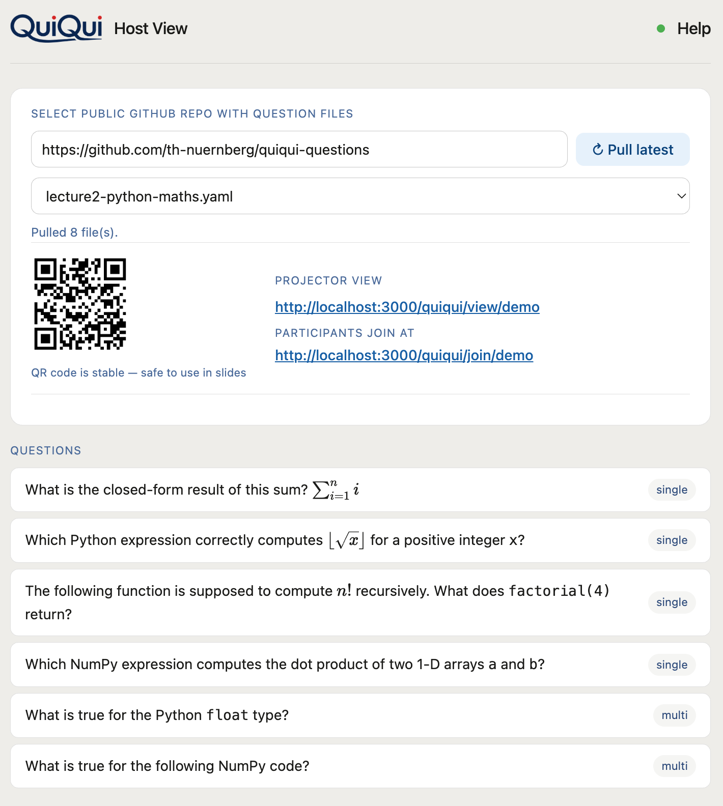
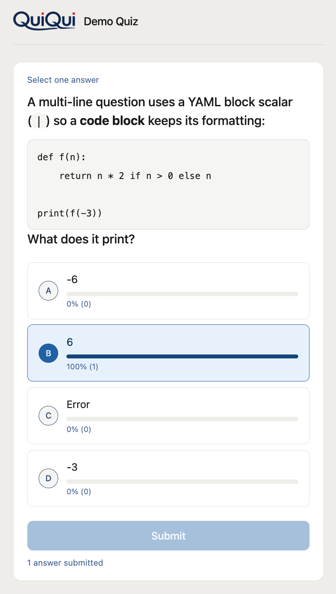

# Quickstart for Lecturers

> Part of the [QuiQui](https://github.com/th-nuernberg/quiqui) open source project. Hosted instance: [kiz1.in.ohmportal.de/quiqui](https://kiz1.in.ohmportal.de/quiqui).
>
> Got a quick question? See the **[FAQ](FAQ.md)**.

QuiQui lets you pose a question to your class and see live answers on screen — no app, no login, no setup for participants.

Everything that defines your session — the questions, the join URL, the correct answers — is **injected from your GitHub repo**, not stored in the tool. QuiQui keeps nothing itself: you point it at your repo, pull, and your session appears. That's why the first step below is setting up your own repo.

---

## What you need

- Your QuiQui host URL (bookmarked once, reused every lecture)
- A public GitHub repository with your question files — see [th-nuernberg/quiqui-questions](https://github.com/th-nuernberg/quiqui-questions) for the format

---

## Before the lecture (once)

1. **Set up your own question repo** on GitHub — see [Creating your own question repo](#creating-your-own-question-repo) below if you've never used GitHub before; it takes about two minutes and needs no coding
2. **Bookmark your host URL:**
   ```
   https://kiz1.in.ohmportal.de/quiqui/<host-slug>?repo=https://github.com/you/quiqui-questions
   ```
   You have two options here:
   - **Use the hosted instance** ([kiz1.in.ohmportal.de/quiqui](https://kiz1.in.ohmportal.de/quiqui)) — contact the [hosted service operator](https://kiz1.in.ohmportal.de/quiqui/impressum#en) to receive your host slug, which goes in place of `<host-slug>` above.
   - **Deploy your own instance** — QuiQui is open source ([th-nuernberg/quiqui](https://github.com/th-nuernberg/quiqui)); deploy it yourself and set your own `HOST_SLUG`. You then control your own host URL.
3. **Put the participant QR code or URL in your slides** — it never changes as long as `session_url` in `config.yaml` stays the same. The `session_url` must be **globally unique** on the server — see [Choosing a unique `session_url`](#choosing-a-unique-session_url) below
4. **Optionally bookmark the projector URL** (`/view/<session_url>`) to open in your browser during the lecture — it shows the live question and results on your beamer alongside the QR code

---

## Creating your own question repo

You don't need to know Git or write any code — GitHub's website does everything below with clicks.

Why you need your own repo at all: your questions and your `session_url` (the address your participants join) live in it. The example [th-nuernberg/quiqui-questions](https://github.com/th-nuernberg/quiqui-questions) repo works to try QuiQui out, but it's **shared by everyone trying the demo** — if two people run a live poll from it at the same time, they end up in the same session and see each other's votes. QuiQui will warn you if that's about to happen (see [During the lecture](#during-the-lecture)), but the fix is your own repo, not working around the warning.

1. **Create a free GitHub account** at [github.com/join](https://github.com/join) if you don't have one already — just an email address, no payment details
2. **[Create your own copy →](https://github.com/new?template_owner=th-nuernberg&template_name=quiqui-questions&name=quiqui-questions&description=My+QuiQui+questions&visibility=public)** — this pre-fills GitHub's "create repository" page from the example repo as a template; just confirm and click **Create repository**. (Same result as forking, but you get a clean repo with no shared history, under whatever name you pick.)
3. **Make sure it stays public** — the visibility is pre-set to Public in the link above, which is required (QuiQui only reads public repos); don't change it
4. **Edit `config.yaml`** directly on GitHub: open the file, click the pencil ✎ icon, change `session_url` to something that's unmistakably yours (e.g. `yourname-databases101`, not just `databases`), then click **Commit changes**. See [Choosing a unique `session_url`](#choosing-a-unique-session_url) below for why this matters
5. **Edit or add a `.yaml` question file** the same way — click a file like `lecture1-python-basics.yaml`, click ✎, change the questions, **Commit changes**. To add a new file for a new topic, use **Add file → Create new file** in the repo
6. **Copy your repo's URL** from the address bar, e.g. `https://github.com/yourname/quiqui-questions` — that's the `repo=` value in your host URL (see [Bookmark your host URL](#before-the-lecture-once) above)

That's it — no local installs, no command line. Everything from here on (adding questions, changing `config.yaml`, fixing typos) happens the same way: edit the file on GitHub, commit, then click **Pull latest** in the host view.

> **Prefer AI-assisted question writing?** See [Designing your questions](#designing-your-questions) below — there's a ready-made prompt for generating a whole question file with ChatGPT or Claude, which you then paste into a new file on GitHub using the same ✎ steps above.

---

## Setting up `config.yaml`

Every question repo needs a `config.yaml` in its root. Start from the template: **[config.yaml in the question repo](https://github.com/th-nuernberg/quiqui-questions/blob/main/config.yaml)** — copy it into your own repo and edit the values.

```yaml
session_url: thn-db-alb      # unique participant join URL segment — see below
title: Databases             # shown as "QuiQui: Databases" in header and tab
host_shortlink: https://t.ly/abc   # optional, a short link participants can type
shuffle: true                # optional, randomise answer order each session (default off)
```

Step by step:

1. **Create your repo** — use the [Create your own copy](#creating-your-own-question-repo) link above, or start a fresh public GitHub repo
2. **Add `config.yaml`** to the repo root, using the template above as a starting point
3. **Set `session_url`** to a unique value (see the next section — this is the important one)
4. **Set `title`** to your lecture name — it appears as `QuiQui: <title>` on the host and participant pages
5. **Optionally set `host_shortlink`** if you have a short URL (e.g. from t.ly or your own redirect) that's easier for participants to type than the full `/join/...` link
6. **Optionally set `shuffle: true`** to randomise each question's answer order — handy when you keep the correct answer first in your file, or reuse a public question deck. The order is fixed for the whole room and reshuffles every time you Load questions. Add `shuffle: false` to an individual question to keep its order (e.g. "All of the above" or a deliberately ordered list)
7. **Commit and push** — your repo is now ready to use

### Choosing a unique `session_url`

> ⚠️ **`session_url` must be globally unique on the server.** A session is identified by its `session_url`, not by you — anyone running with the same value (including colleagues sharing one question repo) shares **one** live session, silently overwriting each other's active question and mixing participants' votes together. Don't use a generic lecture name like `databases`; prefix it to make it unmistakably yours, e.g. `thn-db-alb`. Full naming guide: [Choosing a `session_url`](https://github.com/th-nuernberg/quiqui-questions#choosing-a-session_url) in the question repo README.

---

## Designing your questions

Questions live in `.yaml` files in your repo — one file per lecture topic. The **[question repo README](https://github.com/th-nuernberg/quiqui-questions)** is the full reference: field format, Markdown + LaTeX support, copy-paste examples, ready-made templates, and even a prompt for generating a question file with ChatGPT or Claude. Start there.

Two things to decide before you write questions:

- **Scored or generic?** Include a `correct` field and the **✓ Reveal** button highlights the right option(s) in green for the room. Omit it to keep the question text in your slides and just collect votes — Reveal is hidden, and answers show as letter badges (A, B, C, …). The ready-made [`generic.yaml`](https://github.com/th-nuernberg/quiqui-questions/blob/main/generic.yaml) has A/B/C/D, Yes/No, True/False, and agreement-scale templates for this mode.
- **Which file to start from?** The per-lecture examples like [`lecture1-python-basics.yaml`](https://github.com/th-nuernberg/quiqui-questions/blob/main/lecture1-python-basics.yaml) show scored single- and multiple-choice questions with explanations.

To change questions later, edit the `.yaml` files in GitHub and click **Pull latest** in the host view — no server restart needed.

---

## During the lecture



1. **Open your bookmarked host URL** — the repo is pulled automatically and the QR code appears
2. **Project the QR code** so participants can join (or share the URL verbally)
3. **Select a question file** from the dropdown, then click a question to preview it
4. **Click ▶ Open** — voting opens; badge shows **● Active**. Click again (**⏸ Pause**) to stop voting without revealing answers — participants see the result bars but no highlights
5. **Click ✓ Reveal** to show the correct answers highlighted in green for everyone in the room
6. **Click ✕ Close** to send participants back to the waiting screen without revealing answers
7. **Click Next question →** to move on — participants return to the waiting screen automatically

> **Happy path:** Open → (participants vote) → Reveal → Close → Next question →

> **Tip:** Open the host page a minute before class to make sure your repo pulls cleanly and the QR code is ready before participants arrive.

> **Session lifetime:** A session expires after **90 minutes of inactivity**. After expiry, click **Pull latest** to start a fresh session — the participant URL stays the same.

> **"Session may be in use elsewhere" warning:** If you pull a repo whose `session_url` already has a live poll running from a different browser, QuiQui warns you before taking over — this is the safety net for two people accidentally sharing one repo (e.g. the shared demo repo). If it's your own poll from another tab or device, confirm to continue; if you don't recognise it, cancel and check your `session_url` is actually unique to you.

---

## What participants see



Participants visit the join URL or scan the QR code — no login, no app install. They see "Waiting for the next question" until you open a question. After submitting their answer (only once per question), the result bars appear live under each answer option.

- **Pause** — participants see the bars without correct answer highlights
- **Reveal** — correct answers highlighted in green for everyone
- **Close** — participants return to the waiting screen

If a participant hasn't voted when you pause or reveal, they see "Voting has ended." and the bars — but cannot submit. If a participant refreshes after submitting, they see the question with bars but cannot submit again.

---

## Projector view (beamer)


Open `/view/<session_url>` in your browser and project it on the beamer. It shows the same question and live result bars as the participant view, plus the QR code and join URL — so participants can scan at any time. No submit button, no interaction needed.

The projector URL is shown in the host view next to the participant join URL as soon as a repo is pulled. If your organisation doesn't allow browser add-ins in PowerPoint, this is the recommended way to display live results during a presentation.
